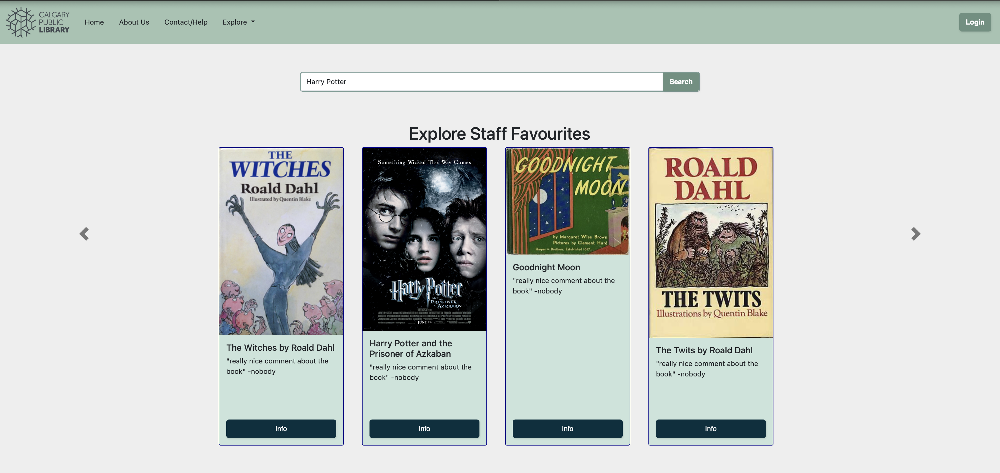
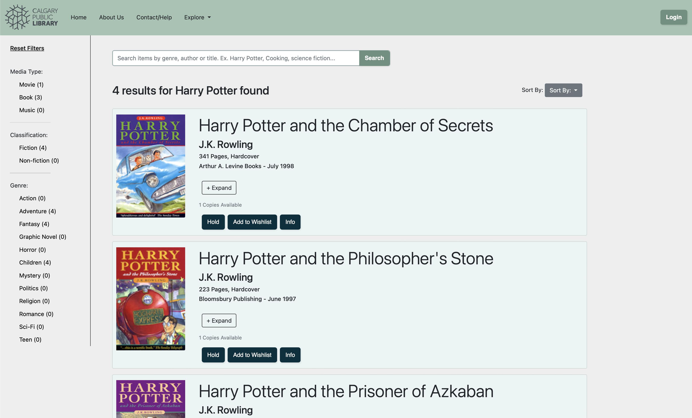
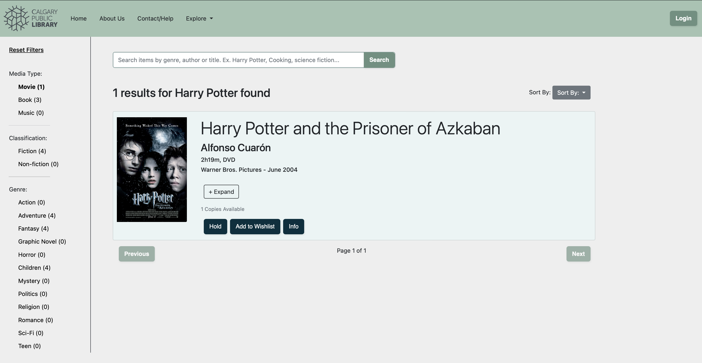

# Library User Interface Prototype

## Setup

Create a local copy of the repository and run with visual studio 2022. Requires .NET 6.0

## Introduction

This website was originally completed as a part of CPSC 481, where students had to design a website with a friendly user interface with C# using the Blazor framework. My responsibility was to implement the search engine features, results display and results filtering, as seen by the images below. 

To see the main branch: [Click Here](https://github.com/BradenThomp/CPSC481_Prototype)

### Home Screen 

### Search Results

### Filtered Results

